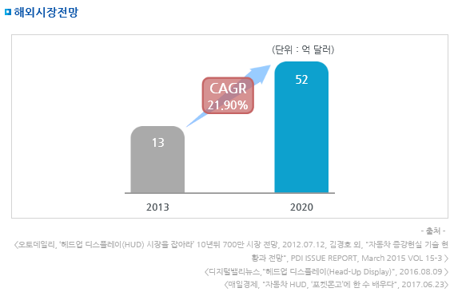

# Head Up Display 해외 시장 규모는?

HUD 세계 시장은 2013년 13억 달러에서 CAGR 21.9%로 성장하여 2020년 52억 달러로 증가할 것으로 예측됩니다. 

[답변 내용이 너무 적고 다른 질문과 내용이 자꾸 겹칩니다...!]

## 참고문서
- KISTI 유망아이템 지식 베이스: http://boss.kisti.re.kr/boss/item/item_print.jsp?unit_cd=PI000095