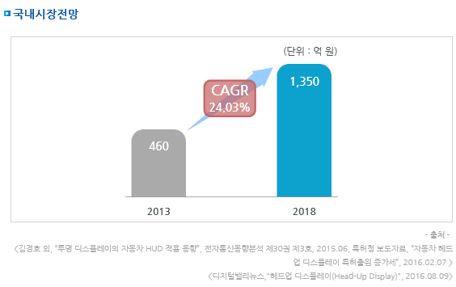

# Head Up Display 국내 시장 규모는?

2013년 중소기업 기술로드맵 보고서(가상현실 장치 및 서비스 산업)에 의하면 2013년 국내의 가상현실 장치 
시장이 세계 시장의 약 3.1%를 점유하고 있는데 이를 HUD에 적용하면 
국내의 HUD 시장 규모는 2013년 38.8 백만 달러(460억)에 CAGR 24.03%로 2018년 113.2 백만 달러(1,350억)로 추정됩니다. 

## 참고문서
- KISTI 유망아이템 지식 베이스: http://boss.kisti.re.kr/boss/item/item_print.jsp?unit_cd=PI000095