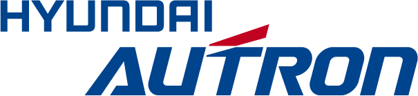
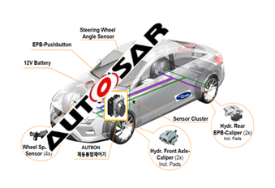

# Head Up Display 시장의 국내 주요 업체는?

Head Up Display 시장의 국내 주요 업체로는 현대오트론과 에이치엘비가 있습니다.

현대오트론은 차량 전자제어분야 연구개발 전문회사로 Head-up Display에 관한 기술 개발로는 증강현실 HUD 시스템 제어기 개발/패키지 소형화, 실 도로 일치 소프트웨어 개발, ADAS 시스템 연동 증강현실 컨텐츠 다양화 등에 집중하고 있습니다.

1985년 창립한 에이치엘비는 이노 GDN 인수 후 바이오 연구기업으로 기초를 다져 왔으며 이후 동아산전 인수 및 국내 유일 구명정 제조 업체인 현대라이프보트의 합병으로 전기계장 및 조선해양분야까지 사업을 확장하였습니다.
더 나아가 유리섬유강화파이프 사업의 편입을 통해 플랜트 사업 내 입지를 강화하였고 또한 국내 최초로 바이오 인공간을 개발하였습니다.
현재 복합소재, 바이오, HUD 사업에 연구개발을 집중하고 있고 국내 최초 완성차급 HUD, HUD용 windshield가 필요 없는 HUD 기술, 사고예방에 실효적인 허상거리 구현 LCD HUD를 개발했습니다.

## 참고문서
- KISTI 유망아이템 지식 베이스: http://boss.kisti.re.kr/boss/item/item_print.jsp?unit_cd=PI000095