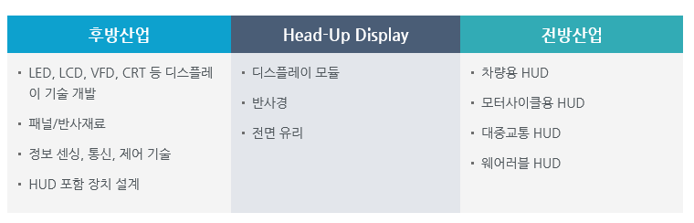

# Head Up Display 전후방 산업 구조는?

Head-Up Display 산업생태계에서 후방산업은 디스플레이 모듈을 위한 디스플레이 기술, 정보 센싱/통신/제어 기술, 반사경과 전면 유리에 적용되는 패널/반사 소재 산업, HUD가 적용되는 장치 디자인 설계 등으로 구성되어 있습니다.
전방산업은 HUD가 적용되는 차량, 모터사이클, 대중교통, 헬멧, 웨어러블 장치 산업 등으로 구성되어 있습니다.

## 참고문서
- KISTI 유망아이템 지식 베이스: http://boss.kisti.re.kr/boss/item/item_print.jsp?unit_cd=PI000095