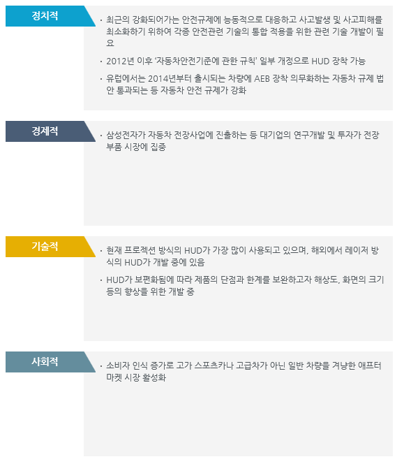

# Head Up Display 시장의 PEST는?

정치적 측면에서는 최근의 강화되어가는 안전규제에 능동적으로 대응하고 사고발생 및 사고피해를 최소화하기 위하여 각종 안전관련 기술의 통합 적용을 위한 관련 기술 개발이 필요합니다. 
2012년 이후 ‘자동차안전기준에 관한 규칙’ 일부 개정으로 HUD 장착이 가능하였고, 유럽에서는 2014년부터 출시되는 차량에 AEB 장착 의무화하는 자동차 규제 법안 통과되는 등 자동차 안전 규제가 강화되었습니다. 

경제적 측면에서는 삼성전자가 자동차 전장사업에 진출하는 등 대기업의 연구개발 및 투자가 전장부품 시장에 집중하였습니다. 

기술적 측면에서는 현재 프로젝션 방식의 HUD가 가장 많이 사용되고 있으며, 해외에서 레이저 방식의 HUD가 개발 중에 있습니다. 
HUD가 보편화됨에 따라 제품의 단점과 한계를 보완하고자 해상도, 화면의 크기 등의 향상을 위한 개발 중입니다. 

사회적 측면에서는 소비자 인식 증가로 고가 스포츠카나 고급차가 아닌 일반 차량을 겨냥한 애프터 마켓 시장이 활성화되었습니다. 

성장요인으로는 소비자 인식 증가로 고가 스포츠카나 고급차가 아닌 일반 차량을 겨냥한 애프터 마켓 시장 활성화로 소비자 수요가 증가하며 대기업의 투자로 앞으로의 전망이 기대되는 것이고, 
저해요인으로는 현재 HUD 수입 비율이 높으며 정밀한 정보 표현과 시야 확보에 보다 기술 발전이 필요하다는 것입니다. 

## 참고문서
- KISTI 유망아이템 지식 베이스: http://boss.kisti.re.kr/boss/item/item_print.jsp?unit_cd=PI000095