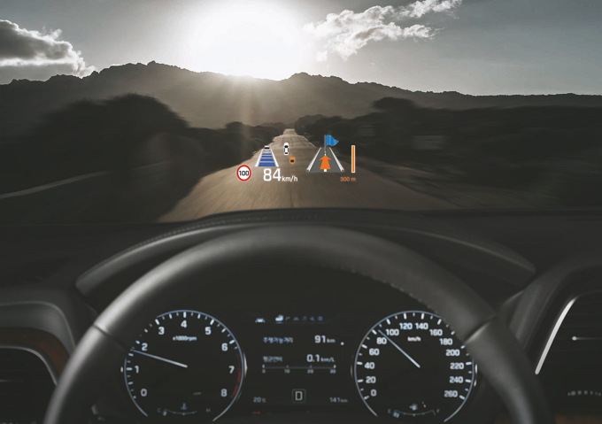

# Head Up Display란?

헤드업 디스플레이란, 운전자 전면 유리창에 계기판 및 내비게이션의 주요정보를 표시하여 운전자의 시선을 분산시키지 않고 정보를 제공하는 편의장치를 말합니다.

디스플레이 기술과 주행환경 인식 기술 등의 발전으로 운전자의 안전 및 편의운전 관련 정보출력을 위한 차세대 디바이스의 관심이 높아지는 중으로 현재 차량용으로는 프로젝션 방식의 HUD가 가장 많이 사용되고 있으며, 해외에서 레이저 방식의 HUD가 개발 중에 있습니다.
HUD는 현재는 차량용으로 가장 많이 활용되고 모터사이클용 혹은 헬멧용 HUD, 대중교통 HUD, 웨어러블 HUD로도 활용이 가능합니다.

## 참고문서
- KISTI 유망아이템 지식 베이스: http://boss.kisti.re.kr/boss/item/item_print.jsp?unit_cd=PI000095