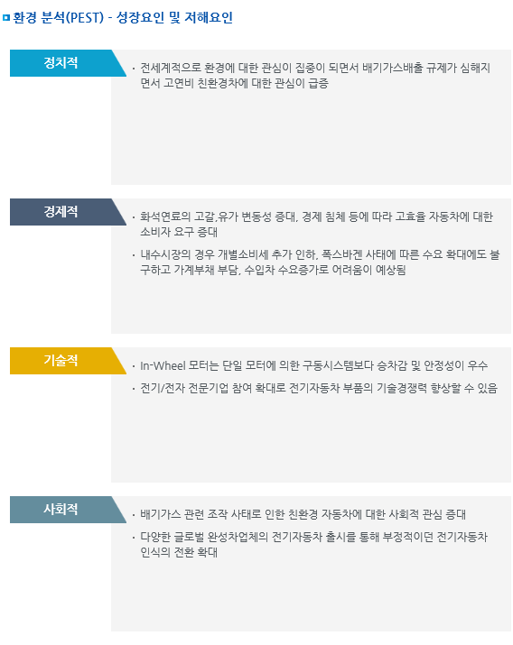

# In-Wheel - PEST

In-Wheel 시장의 환경분석(PEST)로 성장요인 및 저해요인으로 정치적으로는 전세계적으로 환경에 대한 관심이 집중이 되면서 배기가스배출 규제가 심해지면서 고연비 친환경차에 대한 관심이 급증한 것입니다.

경제적인 부분에서는 화석연료의 고갈,유가 변동성 증대, 경제 침체 등에 따라 고효율 자동차에 대한 소비자 요구가 증대하였고 내수시장의 경우 개별소비세 추가 인하, 폭스바겐 사태에 따른 수요 확대에도 불구하고 가계부채 부담, 수입차 수요증가로 어려움이 예상됩니다.

기술적인 부분에서는 In-Wheel 모터는 단일 모터에 의한 구동시스템보다 승차감 및 안정성이 우수하여 전기/전자 전문기업 참여 확대로 전기자동차 부품의 기술경쟁력이 향상할 수 있습니다.

사회적으로는 배기가스 관련 조작 사태로 인한 친환경 자동차에 대한 사회적 관심이 증대하여 다양한 글로벌 완성차업체의 전기자동차 출시를 통해 부정적이던 전기자동차 인식의 전환을 확대하는 것입니다.

## 참고문서
- KISTI 유망아이템 지식 베이스: [http://boss.kisti.re.kr/boss/item/item_print.jsp?unit_cd=PI000013](http://boss.kisti.re.kr/boss/item/item_print.jsp?unit_cd=PI000013)
