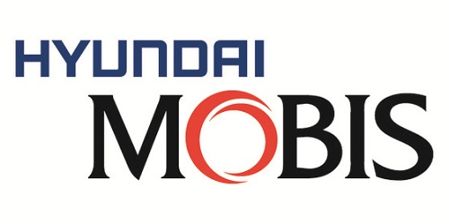
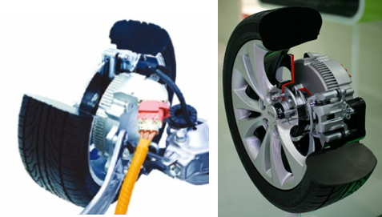

# In-Wheel 시장의 국내 주요 업체는?

In-Wheel 시장의 국내 주요 업체로는 현대모비스가 있습니다. 현대 모비스는 글로벌 부품업계 6위 기업(2015 Automotive News 발표)이며 영업이익률은 10.37% (2014년 기준) 입니다.
사업영역은 모듈(섀시, 운전석, 프론트엔드 등), 핵심부품(구동모터, 배터리시스템 등), AS 부품이고 인휠(In-wheel)시스템의 경우 양산을 위한 프로토타입 신뢰성 검증단계에 있습니다.

친환경 자동차(전기차, 수소연료전기차)에 인휠 시스템을 적용하면 별도의 엔진룸 자체가 필요 없게 되기 때문에 차량 무게가 많이 줄어들어 국내에서는 현대모비스가 주관하여 인휠 시스템의 선행개발 프로젝트에 참여하고 있습니다.
또한 소형 전기차 후륜에 적용 가능한 인휠 모듈 프로토타입 독자 개발을 마치고 신뢰성을 검증하는 단계에 있고 양산가능한 수준의 신뢰성을 확보하기 위해 레이 전기차의 뒷바퀴에 16㎾급 구동모터를 가진 인휠 시스템을 탑재해 여러 가지 시험을 진행하고 있습니다. 

## 참고문서
- KISTI 유망아이템 지식 베이스: http://boss.kisti.re.kr/boss/item/item_print.jsp?unit_cd=PI000013