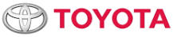
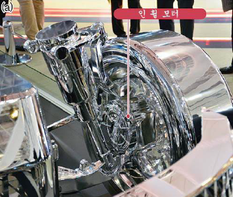

# In-Wheel 시장의 해외 주요 업체는?

해외 주요기업으로는 도요타, 혼다, 아이신, SIM-Drive사(일본), TM4사(캐나다), 미쉐린(프랑스) 이 있습니다. 
TOYOTA는 일본의 대표적인 글로벌기업으로, 전 세계적으로 고급브랜드인 '렉서스'를 주력으로 해외시장 공략에 성공했으며, TOYOTA 브랜드로 하이브리드, 일반 고연비 차량 등을 출시하여 세계적으로 각광받고 있습니다. 
도요타는 설립 35년만에 누적 생산 대수 1000만대를 돌파하는 저력을 보였고 1978년 11월에는 미국 내 수입차 중 승용차 및 트럭 판매대수 1위를 기록했습니다. 이러한 (주)도요타는 1937년 도요타 사키치에 의해 (주)도요타자동직기제작소(1933년 설립)부터 분리하여 독립하였고, (주)도요타자동차공업으로 발족하였습니다. 이후 대형설비투자, 적시의 공장건설과 차종의 확대 등으로 자동차 업계를 주도해왔고, 1950년 판매 부문의 강화를 위해 (주)도요타자동차판매를 설립하였습니다. 

도요타는 점점 균일화 되가는 자동차시장에서 컴팩트 크로스오버의 새로운 방향을 탐구하기 위해 개발된 ‘New C-HR 컨셉트’를 공개하였습니다.  
C-HR 컨셉트는 차량 플랫폼과 파워트레인 구성을 위한 토요타의 통합 개발 프로그램인 Toyota New Global Architecture(TNGA)를 사용하여 만들어져 TNGA 시스템으로 토요타자동차는 섀시 강성, 핸들링 안정성, 편안함이 보다 향상된 차량을 생산하게 될 것입니다. 또한 더 작고 가벼운 모터와 배터리를 채용한 하이브리드 시스템을 개발함으로써 연비를 향상시키고, 열효율이 40 % 이상인 엔진을 탑재하는 것을 목표로 하고 있습니다. 

## 참고문서
- KISTI 유망아이템 지식 베이스: http://boss.kisti.re.kr/boss/item/item_print.jsp?unit_cd=PI000013