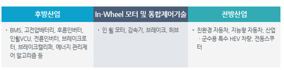

# In-Wheel 시장의 전후방 산업구조는?

In-Wheel의 산업생태계에서 후방산업은 인 휠 모터, 감속기, 브레이크, 허브를 구성하는 소재를 생산하는 산업으로 구성됩니다. 
전방산업은 In-Wheel을 활용하는 친환경 자동차(EV, HEV, FCEV)와 지능형 자동차를 생산하는 산업으로 구성됩니다. 

## 참고문서
- KISTI 유망아이템 지식 베이스: http://boss.kisti.re.kr/boss/item/item_print.jsp?unit_cd=PI000013
