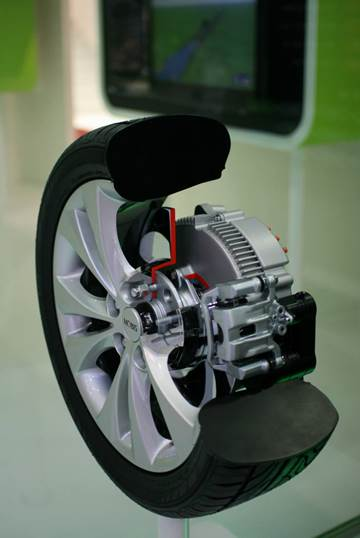
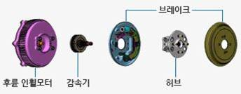

# In-Wheel 모터란?

자동차의 휠(Wheel)마다 모터를 직접 장착해 각각의 휠을 독립적으로 제어하므로 구동 효율과 성능을 향상시키므로 친환경적인 지능형 구동장치를 구사할 수 있습니다.
또한 현가장치, 조향장치, 제동 부품과 구동모터를 휠에 내장하므로 차량의 주행 상태에 따라 바퀴를 독립적으로 제어 할 수 있습니다.

인 휠 시스템은 기본적으로 배터리를 사용하는 친환경 자동차에 적용할 수 있도록 설계되어 친환경 자동차와 지능형 자동차에 활용됩니다.
주차보조 시스템인 SAPS와 인 휠 시스템이 만나면 차량 운전자의 기어 작동 없이도 주차가 가능합니다.
또한 선회 시 선회 반경에 따라 휠 속 하중이 달라지게 되는데 인 휠 시스템은 각 바퀴를 독립적인 구동력을 제공함으로서 선회 시 안전성을 제공합니다.
그리고 미끄럼을 감지해 바퀴 압력과 엔진 출력을 제어하는 ESC와 만난다면 눈길이나 빗길, 고속 선회에서 빈번이 일어나는 스핀을 예방하는데 효과적입니다.
인 휠 시스템은 모터와 감속기, 제동장치와 허브가 하나의 모듈로 전기자동차 바퀴 안에 장착되어 있습니다. 인 휠 모터는 휠 사이즈의 전동 모터이고
감속기는 모터의 속도를 줄이는 기계이며, 브레이크는 자동차의 속도를 감속하거나 정지시킵니다. 허브는 바퀴의 중심 부분으로서 축이 삽입되는 부분입니다.

## 참고문서
- KISTI 유망아이템 지식 베이스: http://boss.kisti.re.kr/boss/item/item_print.jsp?unit_cd=PI000013