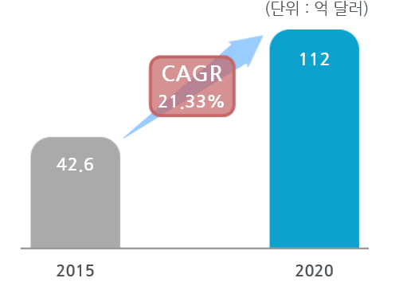

# SRV의 해외시장의 크기는?
자동차용 카메라 해외시장규모은 2015년 42.5억 달러에서 2020년 112억 달러로 증가, 연평균 21.3%의 증가율을 보일 전망으로 해당 시장의 성장이 최근 고도 성장기에 있어, 향후 성장추세가 매우 높을 것으로 예측됩니다.
자동차 안전시스템의 증가, 카메라 기반 운전보조센서 발전, 에프터 서비스 마켓에서의 주차 카메라 소비 증가가 글로벌 자동차용 카메라 시장을 주도하는 주요 성장요인입니다.
다만, 시장 저해요인으로 모듈 제품의 원가가 여전히 비싼 점이 있으나(스마트폰 카메라보다 8배 이상 비싼 원가), 카메라 기술 개발추세와 양산제품 등장으로 원가가 확연히 감소할 전망으로 시장 성장 추세가 높을 것으로 예상됩니다.
 

## 참고문서
- KISTI 유망아이템 지식 베이스: http://boss.kisti.re.kr/boss/item/item_print.jsp?unit_cd=PI000098