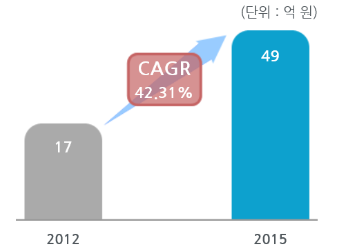

# SRV(Super Rear View System) - 국내시장 크기

자동차용 카메라 국내시장규모는 2012년 17억 원에서 2015년 49억 원으로 증가, 연평균 42.3%의 증가율을 보입니다.
전체 카메라 모듈 시장에서 차량용 카메라 모듈 시장은 전체 시장의 7%에 불과, 카메라 모듈 시장의 성장성에도 불구하고 전체 카메라 모듈 시장에 미치는 영향은 아직 미미한 것으로 보입니다.

## 참고문서
- KISTI 유망아이템 지식 베이스: [http://boss.kisti.re.kr/boss/item/item_print.jsp?unit_cd=PI000098](http://boss.kisti.re.kr/boss/item/item_print.jsp?unit_cd=PI000098)
