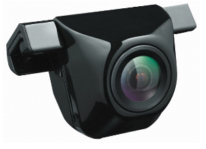
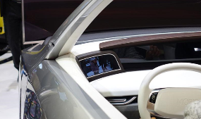

# SRV(Super Rear View System) - 국내 주요 기업

국내 자동차용 카메라 모듈업체로는 삼성전기, LG이노텍, 엠씨넥스, 세코닉스가 존재하며, 완성차업체인 현대자동차, 르노삼성 등에서도 자동차 카메라 관련하여 연구개발하는 것으로 나타납니다.
세코닉스는 부품 제조업체로, 2001년 코스닥 시장에 상장되었으며 2002년 상호를 세코닉스로 변경했습니다. 80년대에는 광메모리에 투자하여 픽업렌즈(Pick-Up Lens)를 생산했고, 시장 상황 변화에 따라 90년대 초에는 보안용 카메라 및 PC 카메라용 렌즈, 90년대 말 휴대폰 카메라용 렌즈 및 대형 디스플레이용 광학엔진모듈을 개발하였습니다. 주로 휴대폰 및 차량용 카메라 등에 쓰이는 플라스틱 렌즈를 생산하여 대기업에 납품하고 있고, 종속회사로 2002년 설립한 중국 법인(WEIHAI SEKONIX OPTICAL ELECTRONICS Co.,Ltd.)이 있으며 지분의 100%를 보유하고 있습니다.

세코닉스는 저전압차등시그널링(LVDS) 방식의 자동차용 어라운드뷰카메라(AVC)를 오는 2018년 양산할 계획으로, LVDS는 빛으로 통신신호를 주고 받는 광섬유케이블을 사용해 전송 대역폭이 넓고 속도가 빠른 것이 특징입니다. 현재 연간 200만개의 전장용 카메라를 생산하고 있는 가운데 내년에는 300만개까지 생산량을 늘릴 계획입니다. 또한 세코닉스의 자동차용 카메라가 확대 적용되면서 매출 증가가 전망, 모바일 부문에서는 듀얼카메라 적용이 증가하면서 물량 확대가 예상되고 있습니다. 특히 자동차용 카메라는 후방카메라에서 전방카메라, ARV, ADAS 등으로 적용 범위가 확산되면서 소요 물량이 빠르게 증가하고 있고, 광학기술을 기반으로 한 다양한 차량용 제품으로 사업영역이 넓어질 것으로 전망됩니다.

현대모비스는 1977년 설립되어 자동차 모듈과 핵심부품, AS부품 등을 생산하여 공급하고 있으며, 현재 글로벌 자동차 부품업계의 6위로 자리매김하고 있습니다. 기술연구소, 품질연구소 등 자동차 부품 제조의 각 분야에 대한 연구소를 보유하고 있으며, 이를 바탕으로 모듈 제조사업, 첨단 자동차부품사업, 핵심부품 제조사업, AS부품사업, 해외 OEM사업을 진행하고 있고, 특히 최근에는 주요 원천 기술에 대한 기술 자립성 확보에 노력함과 더불어 자동차 부품모듈과 전자기술을 융합한 새로운 형태의 독자제품을 선보이기 위해 다양한 선행기술 개발에 역량을 집중하고 있습니다.

## 참고문서
- KISTI 유망아이템 지식 베이스: [http://boss.kisti.re.kr/boss/item/item_print.jsp?unit_cd=PI000098](http://boss.kisti.re.kr/boss/item/item_print.jsp?unit_cd=PI000098)
