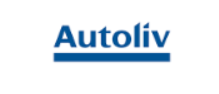
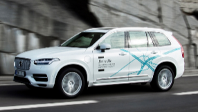
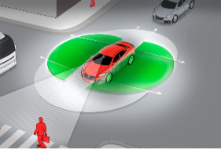

# SRV(Super Rear View System) - 해외 주요 기업

자동차용 카메라 해외시장의 주요기업으로는 Autoliv, Inc., Delphi Automotive PLC, Denso Corporation, Robert Bosch GmbH, Valeo S.A, TRW Automotive가 있습니다.
오토리브(Autoliv)는 1953년 스웨덴 Vargarda에서 창립, 1956년 안전벨트, 1980년 에어백 생산을 시작한 이래로 끊임없는 제품 혁신을 통해 자동차 안전성 향상에 주력하면서 1997년 측면 에어백, 2005년에는 나이트 비전 시스템, 2008년엔 보행자 감지인식 시스템을 선보이며 오늘날 주요 자동차 기업에 안전장치 시스템을 공급하는 글로벌 리더로 자리매김합니다.
오토리브가 달성한 판매액 65억 불은(이중 53%는 유럽지역 내 판매) 185억 불 규모 세계 자동차 컨트롤 시스템 시장의 3분의 1을 차지하는 비중으로, 31개 자동차 생산국에 80개 제조공장, 11개국에 113개 기술센터, 21개 충돌시험도로를 갖추고 있으며, 전 세계적으로 41,000명의 임직원을 고용하고 있는데 이 중 4,000명이 연구, 개발, 엔지니어링 부문에서 활동 중에 있습니다.

볼보는 자동차 업계에서는 최초로 오토리브와 함께 자율주행 자동차 개발을 위한 합작사를 설립, '16년 9월에 체결한 기본 합의에 따라 자율 주행과 운전자 지원 시스템의 소프트웨어 개발하기 위한 합작 Zenuity (제니티)를 설립하기로 최종 합의했습니다. 이 합의에 따라 오토리브는 총 약 11억 크로나(약 150억원)를 Zenuity에 투자하고, Zenuity의 소유권은 볼보 자동차와 오토리브가 각각 50% 가지게 됩니다.
오토리브와 볼보는 Zenuity를 통해 서로가 가진 ADAS 지적 재산권의 사용 허가 및 양도를 진행하고, 이를 기반으로 Zenuity를 통해 새로운 ADAS 제품 및 자율주행 기술을 개발, 첫 번째 ADAS 제품은 2019년부터 판매하는 것을 목표로 하고, 오토리브는 Zenuity가 생산한 모든 제품에 대한 판매 유통을 진행하며, 볼보는 생산된 제품을 공급받게 됩니다.

마그나(Magna)는 1957년 설립됐으며, '14년 366억달러(약 43조원)의 매출을 달성해 글로벌 자동차 부품 시장에서 독일 보쉬의 뒤를 잇고 있고, 미국 자동차회사인 GM, 포드, 테슬라부터 독일 폴크스바겐, 메르세데스 벤츠, BMW 등을 고객사로 확보하고 있습니다. 또한 한국의 현대·기아자동차도 고객이며, 2009년 현대차그룹과 위아마그나파워트레인을 설립해 4륜구동시스템 사업에서 협력하고 있습니다.
또한 전 세계 29개국에서 317개의 생산공장과 83개의 엔지니어링 및 판매 센터를운영하고 있으며, 글로벌 직원 수는 약 13만3천명 정도입니다.

  

## 참고문서
- KISTI 유망아이템 지식 베이스: [http://boss.kisti.re.kr/boss/item/item_print.jsp?unit_cd=PI000098](http://boss.kisti.re.kr/boss/item/item_print.jsp?unit_cd=PI000098)
