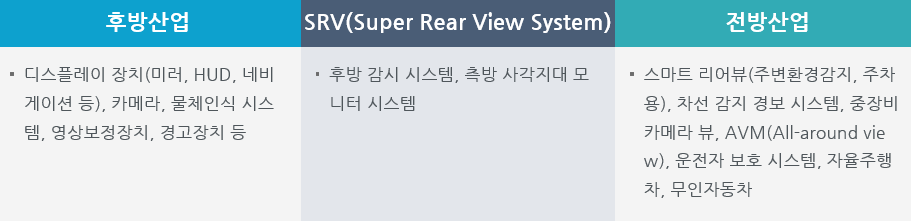

# SRV(Super Rear View System) - 전후방 산업구조

SRV(Super Rear View System)에서 후방산업은 디스플레이 장치, 카메라, 물체인식 시스템 등의 부품을 생산하는 산업으로 구성되며, 전방산업은 스마트 리어뷰, 차선 감지 경보 시스템, 중장비 카메라뷰 산업으로 구성됩니다.
후방 산업에는 디스플레이 장치(미러, HUD, 네비게이션 등), 카메라, 물체인식 시스템, 영상보정장치, 경고장치 등이 있습니다. SRV는 후방 감시 시스템, 측방 사각지대 모니터 시스템가 있습니다.

전방산업으로는 스마트 리어뷰(주변환경감지, 주차용), 차선 감지 경보 시스템, 중장비 카메라 뷰, AVM(All-around view), 운전자 보호 시스템, 자율주행차, 무인자동차가 있습니다.

## 참고문서
 - KISTI 유망아이템 지식 베이스: [http://boss.kisti.re.kr/boss/item/item_print.jsp?unit_cd=PI000098](http://boss.kisti.re.kr/boss/item/item_print.jsp?unit_cd=PI000098)
