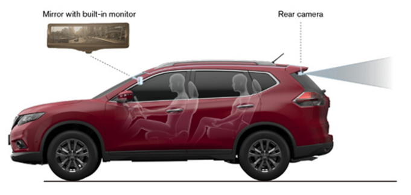

# SRV(Super Rear View System) - 개념

SRV(Super Rear View System)란 차량 후방에 2개의 카메라를 통해 180도 이상의 Panorama View 영상을 확보하여 후방의 움직이는 물체를 감지하는 후방 및 주차 상황을 모니터링 하는 시스템으로 사각지대거나 인지하기 어려운 주변환경 및 도로상황을 편리하게 파악하게 해주므로 자동차 안전성 확보의 중요성이 커지면서 중요성이 대두됩니다.

## 참고문서
- KISTI 유망아이템 지식 베이스: [http://boss.kisti.re.kr/boss/item/item_print.jsp?unit_cd=PI000098](http://boss.kisti.re.kr/boss/item/item_print.jsp?unit_cd=PI000098)
