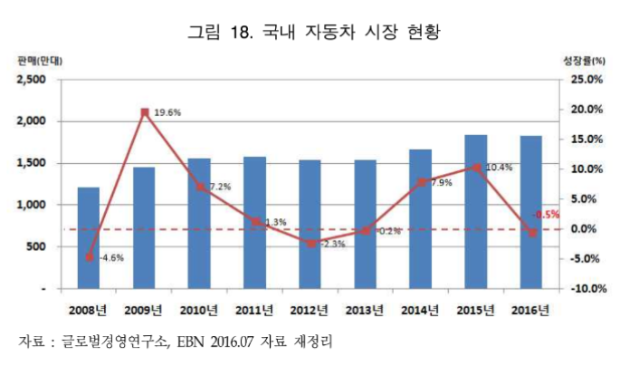

# xEV 배터리 - 국내 시장 규모

국내 자동차 시장은 2015년 사상 최대인 183만대가 판매되었고, 2016년 상반기 까지만 하더라도 신차 출시와 개별소비세 인하 연장에 힘입어 2015년 상반기 대비 9.0% 가량 성장하여 2009년 이후 최대 수준의 성장을 이루었으나, 하반기에는 내수시장의 급격한 축소로 인해 2015년 대비 0.5% 감소된 총 1,824만대 판매가 예상되 어 2014년 이 후 3년 만에 다시 감소세를 보일 것으로 예상됩니다.

## 참고문서
- BOSS Report: xEV 배터리 하우징 기술시장 동향.pdf
