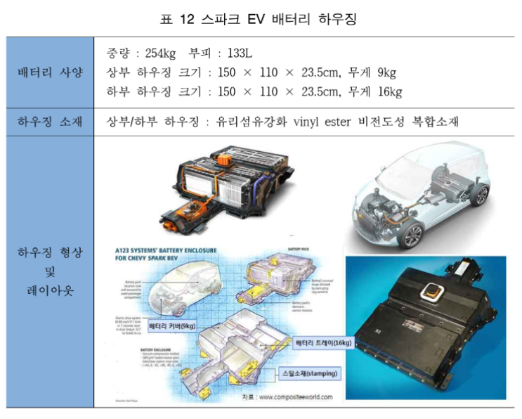

# xEV 배터리 시장의 국내 주요 업체는?

한국GM은 2013년 스파크 EV을 출시하였고 GM이 EV1 이후 14년 만에 미
국 시장에 내놓는 순수 전기자동차로 한국GM 창원 공장에서 생산되고 있습니다. 경차
크기의 차체에 254kg 수준의 배터리를 탑재하고 있으며, 초기 중국 A123사 배터리
를 적용하다가 2014년부터 LG화학의 배터리를 적용하고 있습니다.
배터리 시스템의 경량화를 위해 다른 전기자동차와 달리 상하부 배터리 하우징의
소재로 유리섬유 강화 복합수지를 사용하였고, 하부 배터리 하우징의 마운팅 부분
에 스틸소재가 부분적으로 적용되었다. 이로 인해 금속소재 하우징 대비 40%의 경
량화를 달성하였습니다.
배터리 하우징 소재는 유리섬유강화 vinyl ester 비전도성 복합소재로 Continental
Structural Plastics(CSP)사가 소재를 공급하였고, 제조는 Cytec Industries사에서 담
당하였습니다.

2011년 11월 기아자동차에서는 국내 최초 양산형 전기자동차인 레이 EV 출시하
였고, 2014년 준중형 승용차 쏘울을 베이스로 1회 충전에 148km 주행이 가능한 쏘
울 EV를 출시하였습니다. 
경차를 베이스로 하는 레이 EV의 경우 약 200kg 수준의 배터리가 탑재되었고,
경량화를 위해 상부 배터리 하우징은 인지컨트롤스에서 제조한 복합소재 하우징이
적용되었고, 하부 하우징은 아연도금강판 소재로 동희산업에서 공급되었습니다.
준중형 차체를 가진 쏘울 EV의 경우 배터리 무게만 282kg으로 배터리 하우징 소
재는 상부, 하부 모두 아연도금강판이 적용되었고, 동희산업 김천공장에서 생산되고
있습니다.
레이 EV의 경우 상부 배터리 하우징은 부분은 플라스틱 소재를 적용하였지만, 쏘
울 EV의 경우 배터리 하우징이 커짐에 따라 기존 사출품의 평탄도, 조립성, 수밀성
이 약화되어 스틸 소재로 변경되었습니다.

## 참고문서
- xEV_배터리_하우징_기술시장_동향.pdf