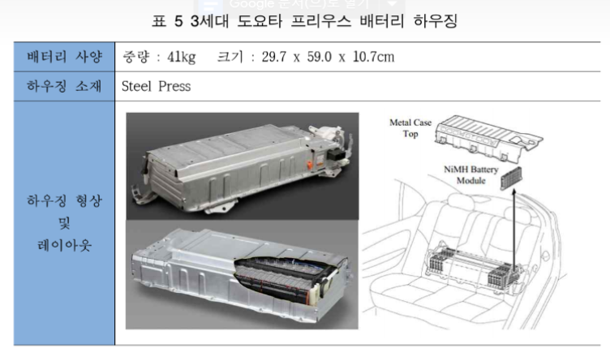

# xEV 배터리 - 해외 주요 기업

##### `Toyota Prius Hybrid`
프리우스는 1997년 세계 최초로 시판된 하이브리자동차의 원조 모델로 2009년 3세대 모델을 거쳐 2016년 4세대 모델까지 출시된 하이브리드 자동차의 선두주자로0만대 이상 판매되었습니다. 3세대까지 프리우스 하이브리드 모델의 배터리 셀은 니켈수소(Ni-MH)가 적용되었으며, 리튬이온 배터리에 비해 성능이 떨어지지만 가격이 저렴하다는 장점을 갖고 있습니다. 최근 출시된 4세대 모델의 경우 리튬이온 배터리를 사용하고 있으며, 3세대까지 배터리 시스템이 트렁크 쪽에 위치하였지만, 4세대 모델에서는 2열 시트 아래로 위치가 변경되었습니다.

3세대 프리우스 배터리 하우징은 일본 太平洋공업에서 생산하고 있으며 스틸 프레스 제품이 적용되었습니다. 프리우스의 배터리 시스템은 빠른 냉각을 위해 블로워와덕트부로 구성된 냉각 모듈이 탑재되었고, 전자파차폐, 컴팩트화를 고려한 설계가 적용되었습니다.

## 참고문서
- BOSS Report: xEV 배터리 하우징 기술시장 동향.pdf
