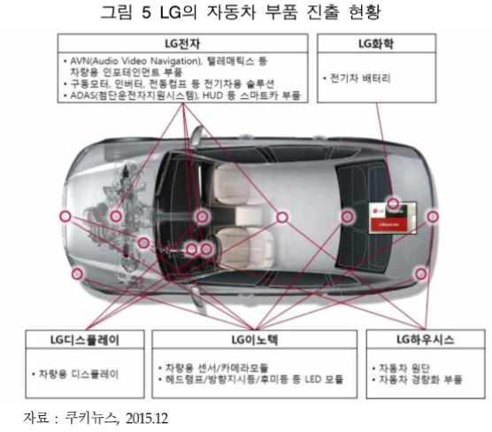

# xEV 배터리 - 공급자

국내에서는 LG가 가장 공격적으로 자동차 부품시장에 진입하고 있습니다. LG 그룹은차세대 성장엔진을 친환경 자동차 부품으로 선정하고 역량을 집중하고 있습니다. 대표적으로 구글 무인차에 LG화학의 배터리팩을 공급하고 있으며, 메르세데스 벤츠의 자율주행자동차의 스테레오 카메라 공동개발, GM Volt EV, 및 현대 아이오닉 EV 에도 배터리팩을 공급하는 등 많은 성과를 거두고 있습니다.

## 참고문서
- BOSS Report: xEV 배터리 하우징 기술시장 동향.pdf
