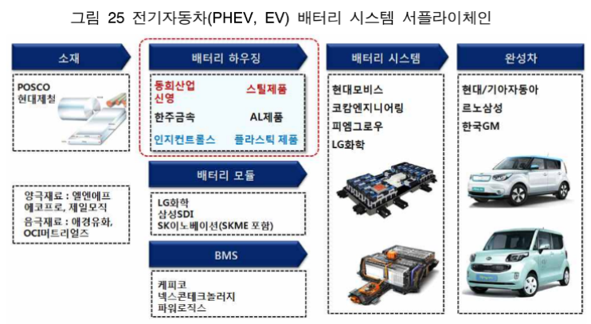

# xEV 배터리 시장의 전후방 산업 구조는?

xEV 차량 중에서 플러그인 하이브리드와 전기자동차처럼 배터리만으로 주행이
가능한 자동차의 경우 배터리 시스템의 제조원가는 최소 45%이상을 차지하고 있으
며, 전기자동차 주행을 위한 에너지원을 제공하는 핵심기술이기 때문에 수소연료전
지 자동차를 제외하고는 대체 불가한 부품이라고 할 수 있습니다.
따라서 배터리 모듈을 보호하고, 차량의 구조적 안전성을 강화하는 역할을 하는
배터리 하우징의 시장은 전기자동차 완성차 및 배터리 시스템 제조 산업과 밀접한
관계가 있으며, 이들 전방산업의 동향에 영향을 많이 받는 종속성이 높은 자동차
부품산업의 특징을 보이고 있습니다.
배터리 시스템 서플라이체인에서 기존 자동차 부품 기업 중 금속 성형가공이나
사출 성형가공 기술을 보유한 기업이 진출할 수 있는 분야는 배터리 하우징 제조가
가장 용이한 분야이며, 지속적인 경량화 소재 적용과 성형 기술개발이 요구되고 있습니다. 
표 19 현대기아차

## 참고문서
- xEV 배터리 하우징 기술시장 동향.pdf