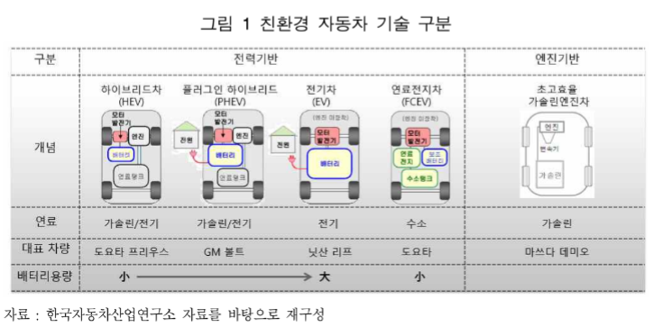

# xEV 배터리 - 개념

최근 자동차 기술개발은 대기 오염물질을 적게 배출하는 환경친화형, 저공해, 온실가스 저감을 위한 저탄소 및 고연비 기술이 핵심으로 부상하고 있습니다. 차세대 친환경 자동차는 배터리나 연료전지 등의 신 동력원의 사용, 초고효율 신연소 기술 등 기존의 대기 오염물질, 온실가스 배출이 적고 연비가 우수한 저탄소 고연비 자동차를 말합니다. 친환경 자동차 기술은 크게 전력기반 차량과 엔진기반 차량으로 구분되며, 차량 경량화 등 공통 기술 개발 분야도 포함 되어 있습니다. 친환경 자동차중 전력을 기반으로 하는 자동차를 xEV라고 하며, 하이브리드 자동차(HEV), 플러그인 하이브리드 자 동차(PHEV), 전기자동차(EV, BEV), 연료전지 자동차(FCEV) 등이 포함됩니다.

## 참고문서
- BOSS Report: xEV 배터리 하우징 기술시장 동향.pdf
