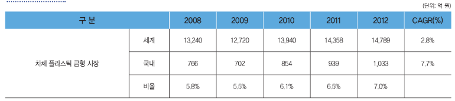

# 경량화 소재 - 해외 시장의 크기는?

자동차 차체 경량화 플라스틱 금형의 세계 시장에서는 해외의 주요 상용차 제조 업체들이 소재 개발 업체와 공동으로 개발 단계의 공급체인(Supplier Chain)을 형성하고 있습니다.

해외 자동차 차체 경량화 플라스틱 금형을 이용한 제품 생산 업체는 현재 상용차 업체와 수지메이커에 의해 주도적으로 진행되고 있으며, 일본의 TORAY, TOYOTA, 후지중공업, 프랑스의 랑세스, 이탈리아의 람보르기니, 중국의 테이진, 미국의 FORD사 및 한국의 현대자동차 등이 있습니다.
이들 대부분은 다국적 기업으로 대형 설비의 제작, 운반, 설치 등의 문제를 해결하기 위해 필요한 지역마다 생산 업체를 두고 있습니다.

자동차 차체 경량화 플라스틱 금형의 세계 시장 규모는 기술 적용 가능한 차체 부품 10종을 기준으로 2012년 2.8%의 연평균 성장률로 연간 약 1조 5,000억 원에 달합니다.
최근 세계 경제의 침체로 자동차 시장 성장이 정체되어, 시장 성장에는 한계가 있으나, 기존 금속 차체 시장의 경량화 추세로 인해 경량화 플라스틱 금형 수요는 점차 증가할 것으로 전망됩니다.
특히 향후 앞서 언급한 가격 경쟁력 확보, 안정성 개선, 디자인 성형 및 리사이클 해결 시점을 기점으로 수요가 크게 증가할 것으로 전망됩니다.

## 참고문서
- 26-2013_자동차 경량화 소재 및 금형.pdf
