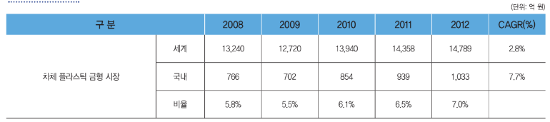

# 경량화 소재 -국내 시장 크기

자동차 차체 경량화 플라스틱 금형의 국내 시장에서는 해외의 주요 상용차 제조 업체들이 소재 개발 업체와 공동으로 개발 단계의 공급체인(Supplier Chain)을 형성하고 있습니다. 현재 국내에서는 자동차 차체 경량화 플라스틱 금형을 생산 및 납품하고 있는 업체가 전무한 실정이며, 해외 선진 업체들과의 경쟁 관계가 아니라 금형 산업의 특징처럼 최종 수요자와 부품 소재 메이커와의 긴밀한 협업을 통해 시장을 개척해야 하는 것이 현실입니다.

국내에서는 미국 GE사와 공동으로 엔지니어링 플라스틱을 사용해서 차체를 약 60kg 경량화에 성공하였으며, 비록 현재는 기존 금속 차체 부품을 대체하기 위한 선행 연구 단계이지만, 국내 금형 산업의 구조 및 환경을 고려할 때 해당 시장은 급속도로 성장할 것으로 예상됩니다.

자동차 차체 경량화 플라스틱 금형 생산의 신규 참여자로는, 기존 대형 내외장 플라스틱 차체 부품을 생산하고 있는 성우하이텍, 일지테크, 한일이화, 에코플라스틱, 대의테크, 평화산업, 신성델타테크, 한국몰드, 덕양산업 등이 기술력과 자본력을 바탕으로 독자 개발 및 선진 메이커들과의 기술 제휴를 통하여 진출할 가능성이 있습니다.

공급자는 최종 플라스틱 성형 차체 부품의 원소재인 엔지니어링 플라스틱, 즉 복합PP(폴리프로필렌), 익시스(IXIS) 등과 고경도 금형강 및 핵심 금형 요소 부품을 제공하는 업체가 주를 이룹니다. 엔지니어링 플라스틱 소재는 현재 대기업(삼성토탈, 한화L&C(구 한화종합화학), 호남석유화학, 제일모직, 효성, 코오롱, 현대EP, 삼성정밀화학, 송원산업 등)과 같은 화학 소재 전문 업체에 의해 공급하고 있습니다. 이들 금형 시장의 성장을 위해서는 고기능 소재 - 컴파운드 - 금형/성형/가공 - 부품 - 신뢰성 평가의 In-Line화된 기술 개발 프로세스가 진행되어야 하며, 특히 자동차 외장 패널의 경우 열에 의한 변형 및 고급 표면 적용의 한계를 극복하기 위해서는 요소별 선순환 개발 구조가 필요합니다. 특히 원천 소재뿐만 아니라, 장수명, 초정밀, 고생산성 금형 개발을 위한 투자를 통해 제조 단가의 경쟁력을 확보하는 것이 중요합니다.

자동차 차체 경량화 플라스틱 금형의 세계 시장 규모는 기술 적용 가능한 차체 부품 10종을 기준으로 2012년 2.8%의 연평균 성장률로 연간 약 1조 5,000억 원에 달하며, 이중 국내 시장 규모는 1,000억으로 세계 시장의 약 7%에 이르며 세계 시장보다 높은 7.7%의 연평균 성장률을 나타내고 있습니다.
최근 세계 경제의 침체로 자동차 시장 성장이 정체되어, 시장 성장에는 한계가 있으나, 기존 금속 차체 시장의 경량화 추세로 인해 경량화 플라스틱 금형 수요는 점차 증가할 것으로 전망됩니다.

특히 향후 앞서 언급한 가격 경쟁력 확보, 안정성 개선, 디자인 성형 및 리사이클 해결 시점을 기점으로 수요가 크게 증가할 것으로 전망됩니다.
2017년에 국내 시장은 2012년 대비 1.5배의 성장을 보일 것으로 전망되며, 세계 시장 규모의 약 9.7%까지 증가할 것으로 예상됩니다.

## 참고문서
- BOSS Report: 26-2013_자동차 경량화 소재 및 금형.pdf
