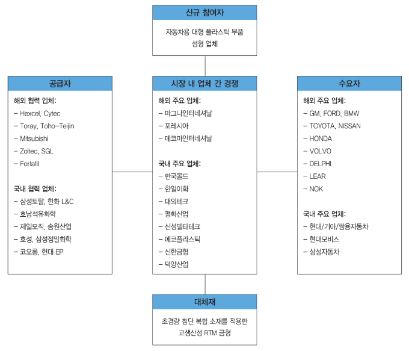

# 경량화소재 시장의 국내 주요 업체는?

자동차 차체 경량화 플라스틱 금형 생산의 신규 참여자로는, 기존 대형 내외장 플라스틱 차체 부품을 생산하고 있는 성우하이텍, 일지테크, 한일이화, 에코플라스틱, 대의테크, 평화산업, 신성델타테크, 한국몰드, 덕양산업 등이 기술력과 자본력을 바탕으로 독자 개발 및 선진 메이커들과의 기술 제휴를 통하여 진출할 가능성이 있습니다. 
공급자는 최종 플라스틱 성형 차체 부품의 원소재인 엔지니어링 플라스틱, 즉 복합 PP(폴리프로필렌), 익시스(IXIS) 등과 고경도 금형강 및 핵심 금형 요소 부품을 제공하는 업체가 주를 이룹니다. 
엔지니어링 플라스틱 소재는 현재 대기업(삼성토탈, 한화L&C(구 한화종합화학), 호남석유화학, 제일모직, 효성, 코오롱, 현대EP, 삼성 정밀화학, 송원산업 등)과 같은 화학 소재 전문 업체에 의해 공급하고 있습니다.

## 참고문서
- 26-2013_자동차 경량화 소재 및 금형.pdf