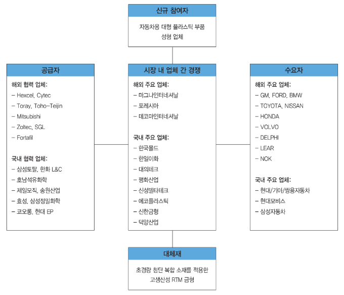

# 경량화 소재 - 해외 주요 기업

해외 자동차 차체 경량화 플라스틱 금형을 이용한 제품 생산 업체는 현재 상용차 업체와 수지메이커에 의해 주도적으로 진행되고 있으며, 일본의 TORAY, TOYOTA, 후지중공업, 프랑스의 랑세스, 이탈리아의 람보르기니, 중국의 테이진,미국의 FORD사 및 한국의 현대자동차 등이 있습니다.
이들 대부분은 다국적 기업으로 대형 설비의 제작, 운반, 설치 등의 문제를 해결하기 위해 필요한 지역마다 생산 업체를 두고 있습니다.

## 참고문서
- BOSS Report: 26-2013_자동차 경량화 소재 및 금형.pdf
