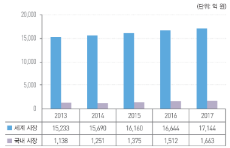

# 경량화소재 시장의 성장률은?

자동차 차체 경량화 플라스틱 금형의 세계 시장 규모는 기술 적용 가능한 차체 부품 10종을 기준으로 2012년 2.8%의 연평균 성장률로 연간 약 1조 5,000억 원에 달하며, 이중 국내 시장 규모는 1,000억으로 세계 시장의 약 7%에 이르며 세계 시장보다 높은 7.7%의 연평균 성장률을 나타내고 있습니다. 
최근 세계 경제의 침체로 자동차 시장 성장이 정체되어, 시장 성장에는 한계가 있으나, 기존 금속 차체 시장의 경량화 추세로 인해 경량화 플라스틱 금형 수요는 점차 증가할 것으로 전망됩니다. 
특히 향후 앞서 언급한 가격 경쟁력 확보, 안정성 개선, 디자인 성형 및 리사이클 해결 시점을 기점으로 수요가 크게 증가할 것으로 전망됩니다. 
2017년에 국내 시장은 2012년 대비 1.5배의 성장을 보일 것으로 전망되며, 세계 시장 규모의 약 9.7%까지 증가할 것으로 예상됩니다.

## 참고문서
- 26-2013_자동차 경량화 소재 및 금형.pdf