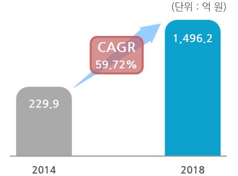

# 나이트 비젼 카메라 시스템의 국내시장의 크기는?
나이트 비전 카메라 시스템의 국내시장 규모는 2014년 약 229.90억에서 2018년 약 1,496.20억원으로 증가, 연평균 59.72%의 증가율을 보일 전망입니다.
국내의 경우 나이트비전 시스템 기술을 블랙박스에 적용하여 보급하고 있으며, 자동차 기술 향상에 따른 퀄리티가 높은 자동차를 요구하는 소비자들이 증가하고 있기때문에 나이트비전 시스템의 시장 또한 확대될 것으로 예측됩니다.
 

## 참고문서
- KISTI 유망아이템 지식 베이스: http://boss.kisti.re.kr/boss/item/item_print.jsp?unit_cd=PI000043
