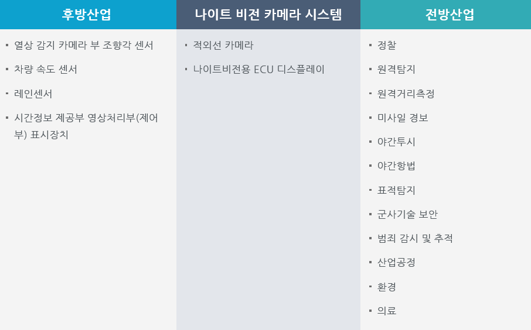

# 나이트 비젼 카메라 시스템의 산업구조 분석하면?
나이트 비전 카메라 시스템의 산업생태계에서 후방산업은 야간카메라 부품 및 전자제어장치, 디스플레이 화면을 구성하는 요소를 생산하는 구조로 구성되어 있으며, 전방산업은 나이트 비전 카메라 시스템을 활용하는 정찰, 탐색, 수색 등 야간에 시야확보를 위한 장치로 활용할 수 있습니다.
후방산업으로는 열상 감지 카메라 부 조향각 센서 , 차량 속도 센서 ,레인센서 ,시간정보 제공부 영상처리부(제어부) 표시장치가 있습니다.
 나이트 비전 카메라 시스템에는 적외선 카메라 ,나이트비전용 ECU 디스플레이가 있습니다.
 전방산업에는 정찰 , 원격탐지 , 원격거리측정 , 미사일 경보 , 야간투시 , 야간항법 , 표적탐지 , 군사기술 보안 , 범죄 감시 및 추적 , 산업공정 , 환경 , 의료
등이 있습니다. 

 

## 참고문서
- KISTI 유망아이템 지식 베이스: http://boss.kisti.re.kr/boss/item/item_print.jsp?unit_cd=PI000043
