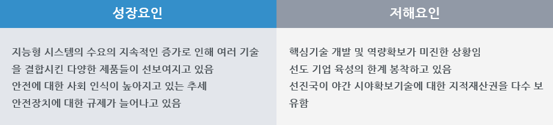

# 나이트 비젼 카메라 시스템를 PEST분석하면?
성장요인으로는 지능형 시스템의 수요의 지속적인 증가로 인해 여러 기술을 결합시킨 다양한 제품들이 선보여지고 있습니다. 
안전에 대한 사회 인식이 높아지고 있는 추세이고 안전장치에 대한 규제가 늘어나고 있습니다.
저해요인으로는 핵심기술 개발 및 역량확보가 미진한 상황이고 선도 기업 육성의 한계 봉착하고 있습니다. 
선진국이 야간 시야확보기술에 대한 지적재산권을 다수 보유하였습니다. 
정치적으로는 정부의 안전관련 규제 강화에 대한 핵심기술 개발 및 역량확보가 미진한 상황입니다.
외국의 선진업체들을 중심으로 국제 규격화를 통한 시장 장벽을 설정하여 선도 기업 육성의 한계 봉착하고 있습니다.
경제적으론 지능형 시스템의 수요의 지속적인 증가로 인해 여러 기술을 결합시킨 다양한 제품들이 선보여지고 있으며 이로 인한 다양한 경제적 효과가 나타나고 있습니다.
기술적으로는 유럽, 일본 등에 비해 야간 시야확보기술에 대한 지적재산권과 기술이 선진국과의 높은 격차를 보이고 있어 이에 대한 기술력 확보가 필요합니다.
사회적으로는 차량과 개인 스마트 기기간의 연결성 요구 증대되고 안전에 대한 사회 인식이 높아지고 있는 추세입니다.
안전문제가 늘어나며 안전장치에 대한 규제가 늘어나고 있습니다.

 

## 참고문서
- KISTI 유망아이템 지식 베이스: http://boss.kisti.re.kr/boss/item/item_print.jsp?unit_cd=PI000043
