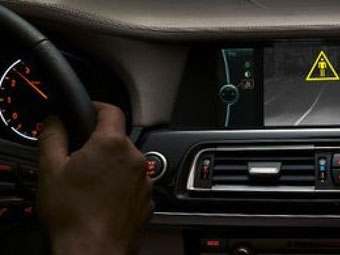

# 나이트 비젼 카메라 시스템이란?
나이트 비젼 카메라 시스템이란 '지능형 운전자 보조시스템(ADAS)'의 한분야로 열화상(Thermal-imaging)기술을 적용하여 야간운전에도 운전자의 시야를 확보하게 함으로 안전성을 강화하게 해주는 운전보조장치입니다.
나이트 비젼 시스템은 고령화 시대에 따른 고령운전자와 운전이 미숙한 여성운전자 등의 증가와 안전운전에 대한 인식 변화에 따른 사회적인 필요에 의해 이용 및 개발이 증가하는 추세입니다.
세계 각국의 여러 자동차 업체마다 지속적으로 개발 및 실용화 추세에 있지만, 생산비용 상 모든 차종에 탑재는 불가능한 실정이며, 일부 고급 차종 또는 용도가 정해진 특수차량 등에 한정해서 설치되어 지고 있습니다.
야간운전시 운전자의 시야확보 뿐만아니라 보행자의 안전까지도 지켜주기 때문에 사회 전반적으로 자동차 안전 필수부품으로 주목 받고 있습니다.

 

## 참고문서
- KISTI 유망아이템 지식 베이스: http://boss.kisti.re.kr/boss/item/item_print.jsp?unit_cd=PI000043
