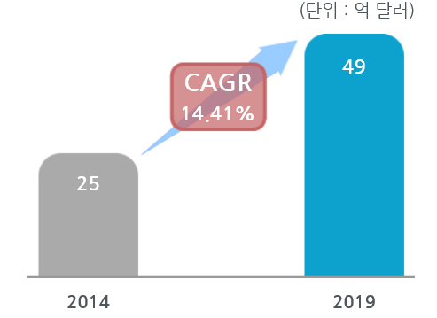

# 나이트 비젼 카메라 시스템 - 해외시장 크기

나이트 비전 카메라 시스템의 해외시장 규모는 2014년 약 25억 달러에서 2019년 약 49억 달러로 증가, 연평균 14.41%의 증가율을 보일 전망입니다. 유럽과 중국, 인도, 일본 등의 아태지역에서 럭셔리카의 요구가 증가하면서 럭셔리카에 탑재되는 나이트비전시스템의 수요 또한 증가할 것으로 예측되어 시장이 확대될 것으로 예측됩니다.

## 참고문서
- KISTI 유망아이템 지식 베이스: [http://boss.kisti.re.kr/boss/item/item_print.jsp?unit_cd=PI000043](http://boss.kisti.re.kr/boss/item/item_print.jsp?unit_cd=PI000043)
