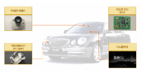

# 나이트 비젼 카메라 시스템 - 국내 주요 업체

나이트 비젼 카메라 시스템 관련 국내 주요경쟁기업으로는 에스엘, 옵트론텍, 파인뷰, 큐알온텍이 나이트비전 관련 기술을 가지고 있는 것으로 나타남
파인디지털의 블랙박스 브랜드 파인뷰가 합리적인 가격대에 첨단 기능을 갖춘 보급형 블랙박스 'T20R'을 출시하였습니다. 고급 기종에만 사용되었던 프리미엄 나이트 비전 기술을 적용, 조도가 약한 지역에서도 선명한 녹화가 이루어질 수 있도록 해 야간 운전 시 안심하고 사용할 수 있습니다. 에스엘은 1954년 설립 이래, 반세기동안 자동차 해드림프 를 비롯한 각종 램프와 샤시, 미러, FEM등 자동차 부품 생산에만 전력을 기울여온 자동차 부품 전문기업입니다.

에스엘은 헤드램프 글로벌 시장점유율 4위에 해당하는 업체로 지능형 해드램프인 AFLS, LED Head Lamp, Bi-function HID System 등을 개발하고 있는 것으로 나타났으며, Lamp 뿐만아니라 chassis, Electronics 분야의 나이트 비전 시스템등 다양한 전장부품을 개발하고 있는 것으로 나타납니다.

옵트론텍은 첨단 광전자부품 분야의 초기 기술력을 기반으로 하는 기업으로 이미지센서용 필터, 광학렌즈 및 모듈, 광pick-up용 필터 등을 생산, 납품하고 있습니다. 옵트론텍은 반사형 적외선 차단필터는 카메라모듈의 이미지 센서 바로 위에 부착되어 적외선을 차단시키고 가시광선만을 투과시겨 이미지센서에 영상을 사람눈에 가깝게 할수 있도록 하는 필터 제품이 있습니다.

Automotive Camera module 제품을 생산중이며 차량의 전후방 카메라, 블랙박스, CCTV용 렌즈와 이미지 모듈을 제공중입니다.

## 참고문서
- KISTI 유망아이템 지식 베이스: [http://boss.kisti.re.kr/boss/item/item_print.jsp?unit_cd=PI000043](http://boss.kisti.re.kr/boss/item/item_print.jsp?unit_cd=PI000043)
