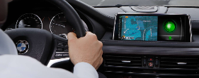
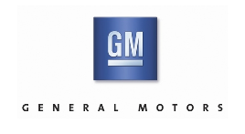
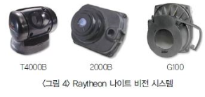

# 나이트 비젼 카메라 시스템 - 해외 주요 기업

나이트 비젼 카메라 시스템 관련 해외 주요 경쟁기업으로는 자동차 업계인 BMW, 아우리, GM등이 있으며 나이트 비전에 대한 기술 개발을 하고 있습니다.아우디 A8에 적용된 나이트비전 어시스트 시스템은 차량 앞쪽 열영상 카메라는 물체에서 방출되는 열에 반응해 산출한 정보를 영상으로 변환해 계기판 사이에 있는 화면에 표시합니다. 전방 300m까지 감지하는 이 시스템은 도로는 어두운 색으로, 사람과 동물은 밝은 색으로 보여줍니다.

BMW그룹은 자동차, 모터사이클, 엔진을 생산하는 독일 회사로 BMW, 미니(Mini), 롤스로이스 등의 브랜드가 있습니다. 2014년 베이징 모터쇼에서 BMW비전 퓨처 럭셔리 컨셉트카를 공개했습니다. 혁신적인 기술과 디자인이 돋보이는 이 차에는 BMW 비전 헤드업 디스플레이 장치와 BMW가 독자적으로 개발한 레이저 헤드라이트가 장착되어 있습니다.

GM은 1908년 설립된 General Motors(이하 GM)은 세계 최초로 자동변속기, 와이퍼 등 오늘날 자동차에 기본으로 적용된 많은 메커니즘을 선보입니다.

레이시온(Raytheon)은 1922년에 설립된 미국의 대표적인 군수업체로, 매사추세츠 주 월텀에 본사가 있습니다.
주로 미사일이나 레이더 등을 생산하며, 주력 생산품은 BGM-109 토마호크 함대지 미사일, 매버릭 공대지 미사일, 패트리어트 지대공 미사일, 사이드 와인더 공대공 미사일 등입니다.

## 참고문서
- KISTI 유망아이템 지식 베이스: [http://boss.kisti.re.kr/boss/item/item_print.jsp?unit_cd=PI000043](http://boss.kisti.re.kr/boss/item/item_print.jsp?unit_cd=PI000043)
