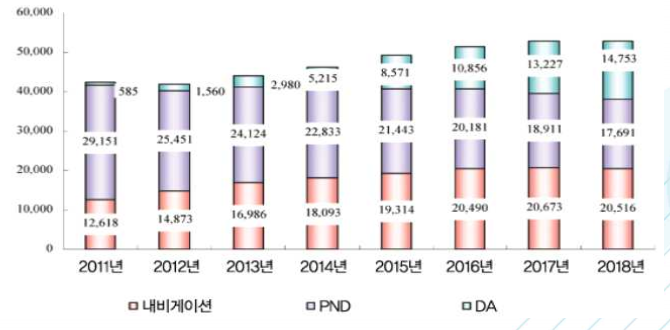

# 네비게이션의 해외 시장의 시장크기는?
전 세계 네비게이션 시장은 2011년부터 2018년까지 7.2%의 연평균 성장률을 가지고 성장해왔으며, 2018년 출하 대수는 2,051만 대 정도로 예상됩니다. 
성장 배경에는 중국산 저가 SD 네비게이션이 있으며, 중국경제의 폭발적인 성장과 더불어 그 규모가 크게 확대된 것으로 보입니다. 
PND(Personal Navigation Device)시장은 스마트폰의 등장으로 시장이 축소되었으나, 2018년 1,769만 대의 출하량이 예상됩니다. 
자동차업체들은 스마트폰 네비게이션을 차량에서 효율적으로 이용가능 하도록 하기 위해 적극적인 움직임을 보이고 있으며, 이 움직임이 신흥국의 수요를 흡수하게 될 것이라고 예상됩니다.

 

현재 중국 내 자동차 시장의 급격한 성장에 힘입어 차량용 네비게이션 시장 규모 역시 꾸준한 성장을 보이고 있습니다. 중국 차량용 네비게이션 시장은 초기 이윤이 크고 진입장벽이 낮아 경쟁이 치열해 지고 있는 상황입니다. 
중국 차량용 네비게이션 출하량은 2015년 4분기에 125만 세트를 도달하며, 크게 성장하였습니다. 
그러나 중국 네비게이션 시장은 핵심 기술 부족 및 가격 경쟁으로 저가의 저품질 제품이 대부분이며, 기술력을 바탕으로한 진출 전략이 필요할 것으로 보이는 시장입니다.

## 참고문서
- 5-2016-네비게이션.pdf