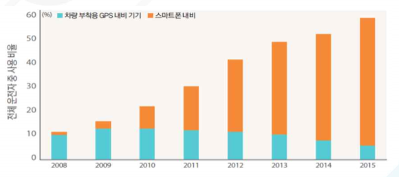

# 네비게이션이란 - 국내 시장 시장 크기

국내 네비게이션 시장은 스마트폰 네비게이션 애플리케이션 보급과 함께 차량 내장형 제품이 퇴보하고 애플리케이션 중심으로 빠르게 재편되고 있습니다. 2015년 기준으로 국내에서 출시된 신차의 내장형 네비게이션 장착 비율은 60% 이상임에도 불구하고 운전자들의 스마프 폰 네비게이션 사용이 증가하고 있습니다. 차량 내장형 네비게이션은 도로 정보 등의 업데이트가 불편하고 실시간 교통정보를 활용하지 못하기 때문에 사용 비율이 낮은 것으로 나타났습니다.

## 참고문서
- BOSS 보고사: 5-2016-네비게이션.pdf
