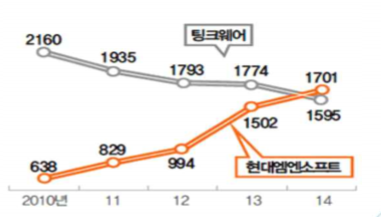
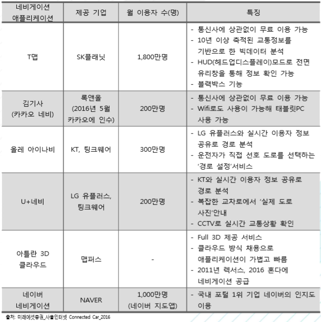

# 네비게이션이란 국내 주요 업체

국내 네비게이션 업계 매출 1위는 아이나비의 팅크웨어였으나, 2015년 현대엠엔소 프트가 국내 네비게이션 업계 1위로 등극했습니다. 팅크웨어는 일반 거치형 네비게이션 제품이 주력제품으로, 네비게이션 애플리케이션 사용이 증가하면서 매출이 급감하고 있습니다.

그러나 현대엠엔소프트는 2005년 현대차그룹에 편입된 이후, 일반 거치형 대신 신차에 탑재되는 순정형 제품으로 승부수를 두었고, 이를 통해 순정형 네비게이션 판매량은 2010년 12만 6,000대에서 2014년 41만 8,000대로 26% 의 연평균 성장률을 보였습니다.

국내 통신 3사 모두 네비게이션 서비스를 제공하고 있으며, 그 가운데 SKT의 T맵은 1,800만명이 넘는 가입자로 50% 이상의 시장 점유율을 기록하고 있습니다. SKT는 기아자동차에서 미러링 방식으로 내장형 네비게이션에서 T맵을 사용할 수 있는 서비스를 2016년 7월부터 시작하였으며, 국내에 출시되는 재규어에도 유사한 방식의 서비스를 제공하기로 제휴한 바 있습니다. KT와 LG 유플러스는 차량용 네비게 이션 선두 사업자인 팅크웨어와 협업하여 올레 아이나비와 U+네비를 리뉴얼 런칭할 예정에 있습니다.

## 참고문서
- BOSS 보고사: 5-2016-네비게이션.pdf
