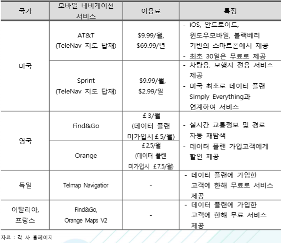
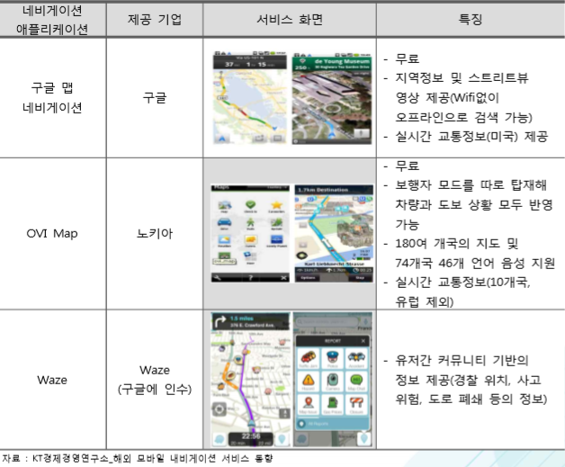

# 네비게이션 시장의 해외 주요 업체에는 어떤 것이 있는지?
 세계 네비게이션 시장은 기존 GPS 기반 네비게이션 기기에서 모바일 기반의 GPS서비스로 옮겨가고 있는데, 해외 통신사들은 대부분 월정액 위주의 모바일 네비게이션 서비스를 제공하고 있으며 전체 이동통신 가입자 수의 8% 정도가 이용하고 있습니다. 
 구글, 노키아 등의 글로벌 플랫폼 사업자들은 무료 서비스를 앞세워 모바일 네비게이션 시장에 진출하고 있습니다.

## 참고문서
- 5-2016-네비게이션.pdf