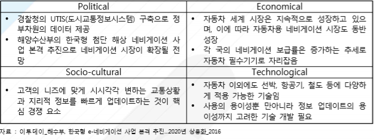

# 네비게이션 -PEST

Political(정치적)으로는 경찰청의 UTIS(도시교통정보시스템) 구축으로 정 부차원의 데이터 제공합니다. 해양수산부의 한국형 첨단 해상 네비게이션 사업 본격 추진으로 네비게이션 시장이 확장될 전망입니다.

Economical(경제적)으로는 자동차 세계 시장은 지속적으로 성장하고 있으며, 이에 따라 자동차용 네비게이션 시장도 동반 성장합니다. 각 국의 네비게이션 보급률은 증가하는 추세로 자동차 필수기기로 자리잡고 있습니다.

Socio-cultural(사회적)으로는 고객의 니즈에 맞게 시시각각 변하는 교통상황과 지리적 정보를 빠르게 업데이트하는 것이 핵심 경쟁 요소입니다.

Technological(기술적)으로는 자동차 이외에도 선박, 항공기, 철도 등에 다양하게 적용 가능한 기술입니다.
사용의 용이성뿐만아니라 정보 업데이트의 용이성까지 고려한 기술 개발 필요합니다.

## 참고문서
- BOSS 보고사: 5-2016-네비게이션.pdf
