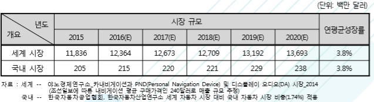

# 네비게이션 시장의 미래시장규모를 예측하면?
네비게이션은 자동차에 장착되어 GPS를 이용하여 길을 안내해주는 장치로, 자동차의 필수기기로 자리잡고 있습니다.
국내외 네비게이션 시장은 스마트폰의 보급 확대와 함께 차량 내장형 및 거치형 네비게 이션에서 스마트폰 네비게이션 애플리케이션 및 서비스로 옮겨가고 있습니다.
글로벌 기업인 구글, 노키아 등뿐 만 아니라 국내의 SK플래닛, 카카오, KT, 팅크웨어 등과 같은 대기업들도 네비게이션 애플리케이션 개발에 뛰어들고 있습니다.
네비게이션 시장에서 모바일 네비게이션의 영역은 점차 넓어지고 있으며, 특히 구글과 애플과 같은 글로벌 기업들의 영향력이 증가하고 있습니다.
최근 애플은 아이폰과 연동되는 차량용 애플 OS인‘카플레 이’를 공개하며 뛰어난 조작성을 발표한 바 있습니다. 이에 따라 현대자동차, 페라리, 메르세데스 벤츠 등 글로벌 자동차 제조사는 점진적으로 카플레이를 탑재하겠다고 밝혔습니다. 
또한 구글도 지난 2014년부터 혼다, 제네럴 모터스(GM) 등의 자동차 제조사와 협력해 안드로이드 OS를 활용한 차량용 서비스와 네비게이션 제품을 개발하였습니다. 
차세대 스마트 자동차에 대한 관심이 증가하면서 모바일 기기와 연동된 네비게이션의 수요가 크게 증가할 것으로 예상됩니다.
야노경제연구소의 자료에 따르면 전 세계 네비게이션 시장 규모는 출하량 기준으로 2015년 4,932만 대에서 2020년 5,706만 대로 전망되며, 매출액 기준으로 추정하면 2015년 118억 3,600만 달러에서 2020년 136억 9,300만 달러로 성장할 것으로 예상됩니다. 
한편, 국내 네비게이션 시장규모는 출하량 기준으로 2015년 85만 대에서 2020년 99만 대로 성장할 것으로 전망되며, 매출액 기준으로 추정하면 2015년 2억 500만 달러에서 2020년 2억 3,800만 달러까지 성장할 것으로 예상됩니다.      

 

## 참고문서
- 5-2016-네비게이션.pdf