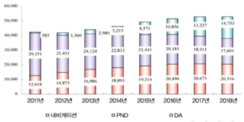
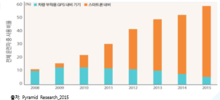

# 네비게이션이란 - 성장률

전 세계 네비게이션 시장은 2011년부터 2018년까지 7.2%의 연평균 성장률을 가지고 성장해왔으며, 2018년 출하 대수는 2,051만 대 정도로 예상됩니다. 성장 배경에는 중국산 저가 SD 네비게이션이 있으며, 중국경제의 폭발적인 성장과 더불어 그 규모가 크게 확대된 것으로 보입니다. PND(Personal Navigation Device) 시장은 스마트폰의 등장으로 시장이 축소되었으나, 2018년 1,769만 대의 출하량이 예상됩니다. 자동차업체들은 스마트폰 네비게이션을 차량에서 효율적으로 이용가능 하도록 하기 위해 적극적인 움직임을 보이고 있으며, 이 움직임이 신흥국의 수요를 흡수하게 될 것이라고 예상됩니다.

Pyramid Research에 따르면 국내 네비게이션 시장은 스마트폰 네비게이션 애플리케이션 보급과 함께 차량 내장형 제품이 퇴보하고 애플리케이션 중심으로 빠르게 재편되고 있습니다. 2015년 기준으로 국 내에서 출시된 신차의 내장형 네비게이션 장착 비율은 60% 이상임에도 불구하고 운전자들의 스마프 폰 네비게이션 사용이 증가하고 있습니다. 차량 내장형 네비게이션은 도로 정보 등의 업데이트가 불편하고 실시간 교통정보를 활용하지 못하기 때문에 사용 비율이 낮은 것으로 나타났습니다.

## 참고문서
- BOSS 보고사: 5-2016-네비게이션.pdf
