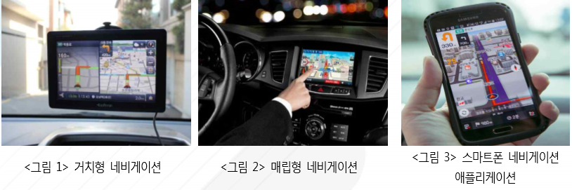

# 네비게이션이란?
 네비게이션이란 보통 자동차에 장착되어 길을 안내해주는 장치로, GPS를 이용하여 현재 위치를 파악하고 목적지로 어떻게 갈지 경로를 설정합니다. 차량용 내비게이션은 센터페시아 위쪽 유리에 부착하 는 거치형과 차량의 센터페시아에 매립하는 내장형 또는 매립형이 있습니다. 
 거치형은 업그레이드와 유지 보수가 용이하나 자동차의 외관을 망치고 시야를 가린다는 단점이 있고, 매립형은 디자인 및 편의성에 서는 장점을 가지나, 업그레이드 및 유지보수가 어렵고 가격이 비싼 단점이 있습니다.
 최근에는 스마트폰 의 급속한 보급 확대로 스마트폰 네비게이션 애플리케이션 사용이 확대되고 있습니다. 
 네비게이션은 길을 찾아주는 기능 외에도 다양한 멀티미디어 기능을 수행하기도 하며, 과속카메라의 단속 위치나 통행료 안내기능 등 운전 중 필요한 다양한 정보를 제공하는 역할을 합니다.

 

## 참고문서
- 5-2016-네비게이션.pdf