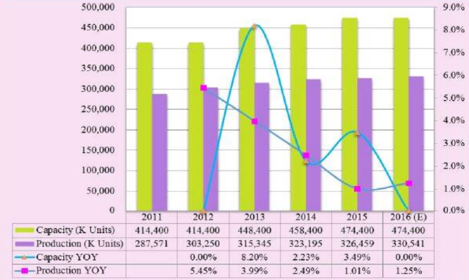
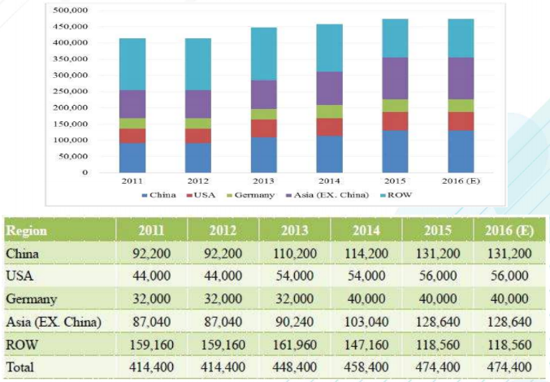
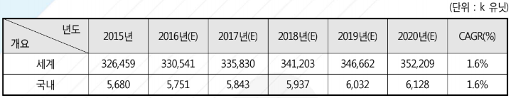

# 자동차 도어 프레임 -  해외시장 규모

세계 자동차용 도어 프레임 시장의 생산용량과 생산량은 꾸준히 증가하고 있습니다. 생산용량은 2011년 4억 1천 Units, 2016년 4억 7천 Units를 기록하였으며, 생산량은 2011년 2억 8천 개에서 2016년 3억 3천 Units으로 증가하였습니다. 자동차 부품 산업은 완성차 업체 및 시장 경기에 직접적으로 영향을 받으며, 주요 매출은 완성차 업체에 크게 의존합니다.

세계 자동차용 도어 프레임 시장의 주요 국가별 생산용량 규모를 살펴보면 2016년 기준으로 중국이 1억 3천 Units으로 가장 높은 시장 점유율을 보이며 중국을 제외한 아시아 지역이 그 뒤를 잇고 있습니다. 이는 중국과 인도 등의 신흥 시장국에서 자동차를 소비할 수 있는 인구가 급격하게 증가함에 따라 늘어나는 경향이 반영된 결과로 볼 수 있습니다. 미국과 독일 시장 역시 시장 규모가 꾸준하게 증가하는 경향을 보입니다.

## 참고문서
- BOSS Report: 24-2016-자동차 도어프레임.pdf
