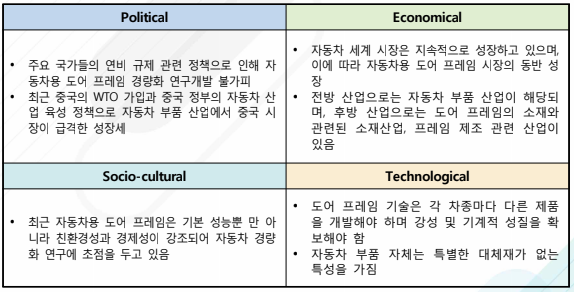

# 자동차 도어 프레임 - PEST 분석은?

정치적 분석입니다. 주요 국가들의 연비 규제 관련 정책으로 인해 자동차용 도어 프레임 경량화 연구개발 불가피합니다.
최근 중국의 WTO 가입과 중국 정부의 자동차 산업 육성 정책으로 자동차 부품 산업에서 중국 시장이 급격한 성장세입니다.

경제적 분석입니다. 자동차 세계 시장은 지속적으로 성장하고 있으며, 이에 따라 자동차용 도어 프레임 시장의 동반 성장 중입니다.
전방 산업으로는 자동차 부품 산업이 해당되며, 후방 산업으로는 도어 프레임의 소재와 관련된 소재산업, 프레임 제조 관련 산업이 있습니다.

사회적 분석입니다. 최근 자동차용 도어 프레임은 기본 성능뿐 만 아니라 친환경성과 경제성이 강조되어 자동차 경량화 연구에 초점을 두고 있습니다.

기술적 분석입니다. 도어 프레임 기술은 각 차종마다 다른 제품을 개발해야 하며 강성 및 기계적 성질을 확보해야 합니다.
자동차 부품 자체는 특별한 대체재가 없는 특성을 가집니다.

## 참고문서
- BOSS Report: 24-2016-자동차 도어프레임.pdf
