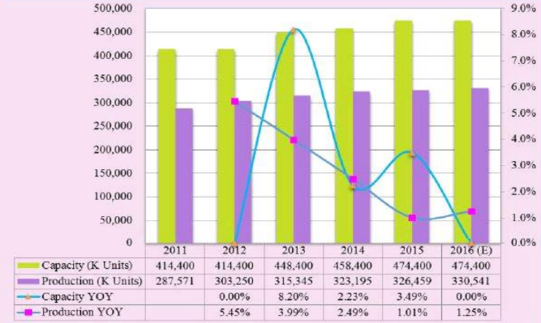
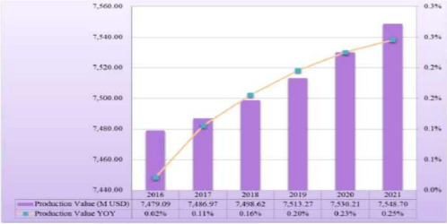

# 도어 프레임 시장의 성장률은?

세계 자동차용 도어 프레임 시장의 생산용량과 생산량은 꾸준히 증가하고 있습니다. 
생산용량은 2011년 4억 1천 Units, 2016년 4억 7천 Units를 기록하였으며, 생산량은 2011년 2억 8천 개에서 2016년 3억 3천 Units으로 증가하였습니다. 
자동차 부품 산업은 완성차 업체 및 시장 경기에 직접적으로 영향을 받으며, 주요 매출은 완성차 업체에 크게 의존합니다.

전 세계 자동차용 도어 프레임 시장의 생산가치 및 성장률은 2016년 이후 꾸준히 성장할 것으로 전망되며, 이에 따라 전후방 산업의 동반성장 또한 기대할 수 있습니다.

## 참고문서 
- 24-2026-자동차 도어프레임.pdf