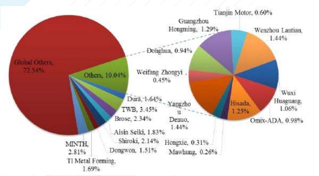

# 해외 도어 프레임 시장의 기업별 점유율은?

전 세계 자동차용 도어 프레임 시장의 주요 업체의 제품 시장 점유율을 비교하면, 2015년 기준 미국의 철강 회사인 TWB가 전체의 3.45%를 차지하여 국가별 주요 업체 중 가장 높은 비중을 차지하고 있습니다. 
그 뒤를 이어 중국의 몰딩 관련 자동차 차량 부품 업체인 MINTH가 2.81%의 비중을 차지하고 뒤를 이어 Brose가 2.34%, Shiroki가 2.14%를 차지하고 있습니다. 
자동차용 도어 프레임 주요 제조업체 중 동원금속은 유일하게 상위권에 속한 한국 국적의 기업으로, 전체의 1.51%를 차지하고 있습니다.

그 밖의 자동차용 도어 프레임 해외 주요 제조업체는 아래와 같습니다.

## 참고문서
- 24-2016-자동차 도어프레임.pdf