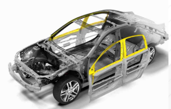

# 자동차 도어 프레임이란?

자동차 도어 프레임은 자동차 부품 중 하나로, 자동차 도어가 필요로 하는 강성 및 기계적 성질을 확보하여야 하고 Window Glass 유지, 주행 중 풍절음 감소, 방수 등의 다양한 역할을 하며 차체의 골격을 지탱하는 중요한 기능을 합니다.
자동차 도어 프레임 제조에는 정밀한 기술이 요구되고, 각 차종마다 다른 제품을 개발해야 하기 때문에 완성차 업체와의 협력관계가 중요합니다.
 
최근 자동차의 개발은 기본 성능뿐 만 아니라 친환경성과 경제성이 강하게 요구되면서 배기가스, 소음, 경량화에 초점을 두고 있습니다.
자동차 경량화는 자동차의 기본 성능인 가속력과 제동력을 향상시키는 직접적인 요인이기도 하며 환경규제 및 고유가 시대의 도래에 의한 연비 개선에 영향을 주는 요인이기 때문입니다.

## 참고문서 
- 24-2026-자동차 도어프레임.pdf