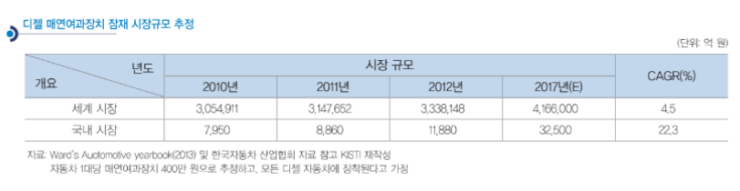

# 배기가스 여과장치 - 성장률

잠재 시장을 추정해 보면, 세계 시장은 2012년 334조 원에서 2017년 416조 원이 되고, 국내 시장은 2012년 1조 2,000억 원에서 2017년 3조 2,500억 원 규모가 될 것으로 추정됩니다. 그러나 승용차에서 디젤의 비중이 점차 커지고 있고, 클린디젤 시장이 커질 것으로 예상되므로 향후 그 시장규모는 더욱 커질 것으로 예상됩니다.

그린카의 중장기적 포트폴리오를 보면 단기적으로는 내연기관의 개선이 효율적이지만, 중장기적으로는 하이브리드 자동차와 클린 디젤자동차 그리고 장기적으로는 전기차와 연료전지차가 주를 이룰 것으로 예상됩니다. 클린 디젤자동차는 중장기적으로 내연기관차와 하이브리드 자동차를 이어주는 다리 역할을 할 것으로 예상되고 있습니다.

## 참고문서
- Boss Report: 23-2014_디젤 매연여과장치_.pdf
