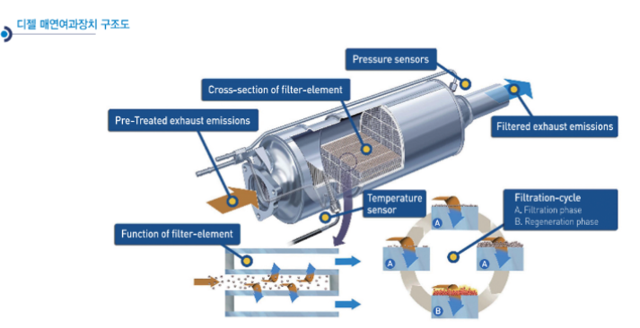

# 배기가스 여과장치란?

디젤 매연여과장치(DPF: Diesel Particulate Filter)는 디젤자동
차의 배기가스에서 분진을 제거하는 필터를 말합니다. 디젤엔진
에서의 매연발생과정을 살펴보면, 연소 시 연료가 연소실에 고
압으로 분사되어 압축공기와 혼합되지만 이 기간이 매우 짧기
때문에 혼합비가 일정하지 않으며, 농후한 혼합비로 혼합되는
경우가 많아 매연이 다량 발생합니다. 디젤엔진의 배기가스 중 직
경 1μm 이하의 작은 먼지인 PM(Particulate Matter)은 봄철 황사
의 영향에 따라 오염도가 증가하며, 인체로 흡입되는 경우에 배
출되지 않고 폐에 침투하여 호흡기 질환이나 폐암을 발생시킬
수 있습니다. 현재 우리나라의 미세먼지 농도는 계속 증가하는 추세
이며, OECD 국가 중 가장 높은 수준으로, 시급히 개선되어야
할 상황입니다. 그래서 디젤엔진 자동차의 경우, 후처리장치의 중
요성이 부각되고 있습니다. 후처리 기술이란 연소실로부터 배출되
는 오염물질을 배기관 내에서 다양한 방법을 이용하여 저감시
키는 기술로서 디젤 질소산화물 촉매 및 환원제 요소기술과 모
델링에 의한 재생 제어로직 기술, 전기 및 화학반응을 이용한
연료 전처리 기술, 오염물질 제어를 위한 NOx/NH3/PM 센서기
술, 연소개선/배기저감을 위한 엔진장착 압력측정 기술, 배기계
모사를 위한 통합모델 개발기술 그리고 차량탑재 실시간 광학
적 입자 측정 기구 기술 등이 포함됩니다.

 

## 참고문서
- 23-2014_디젤_매연여과장치.pdf